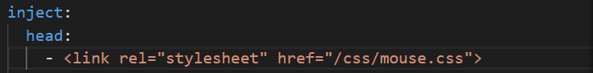

#### Butterfly主题配置

##### 安装步骤

- 移动到博客所在根目录

- 下载主题代码到themes中

  ```
  # 方式1：git方式安装
  git clone -b master https://github.com/jerryc127/hexo-theme-butterfly.git themes/butterfly
  
  # 方式2：npm方式安装
  npm i hexo-themebutterfly
  ```

- 修改hexo的_config.yml文件，将主题改为butterfly

  ```
  theme: butterfly
  ```

  若重启、打开页面报如下错误，因没有**pug**以及 **stylus** 的渲染器，需要安装

  ```
  extends includes/layout.pug block content include ./includes/mixins/post-ui.pug #recent-posts.recent-posts +postUI include includes/pagination.pug
  ```

- 安装pub & stylus

  ```
  npm install hexo-renderer-pug hexo-renderer-stylus --save
  ```

- 最后重启hexo即可

##### 修改主题配置

主题的配置在 **/www/wwwroot/blog/themes/butterfly/_config.yml** 文件中

##### 鼠标样式更改

首先准备想要生成鼠标样式的图片，调整对应的像素大小，将图片类型转换为.cur（或直接在[鼠标指针 - 光标 - 电脑鼠标指针下载 - 致美化 - 漫锋网 (zhutix.com)](https://zhutix.com/tag/cursors/)中找想要的样式），在主题路径source中的css文件夹中新建一个mouse文件夹用于存放这些图片

###### 代码引入

在butterfly主题的`_config.yml`文件中修改如下：



在主题路径source中的css文件夹新建一个`mouse.css`文件，加入类似下列内容：

```css
body,
html {
    cursor: url('./mouse/alternate.cur'), auto !important;
}

/* 悬停图片时的鼠标指针 */
/* 选择链接标签时的鼠标指针 */
/* 选中输入框时的鼠标指针 */
/* 悬停按钮时的鼠标指针 */
/* 悬停列表标签时的鼠标指针 */
/* 悬停页脚链接标签（例如页脚徽标）时的鼠标指针 */
/* 悬停页码时的鼠标指针 */
/* 悬停菜单栏时的鼠标指针 */
img,
a:hover,
input:hover,
button:hover,
i:hover,
#footer-wrap a:hover,
#pagination .page-number:hover,
#nav .site-page:hover {
    cursor: url('./mouse/link.cur'), auto !important;
}
```

重新刷新即可看到鼠标样式已经生效

